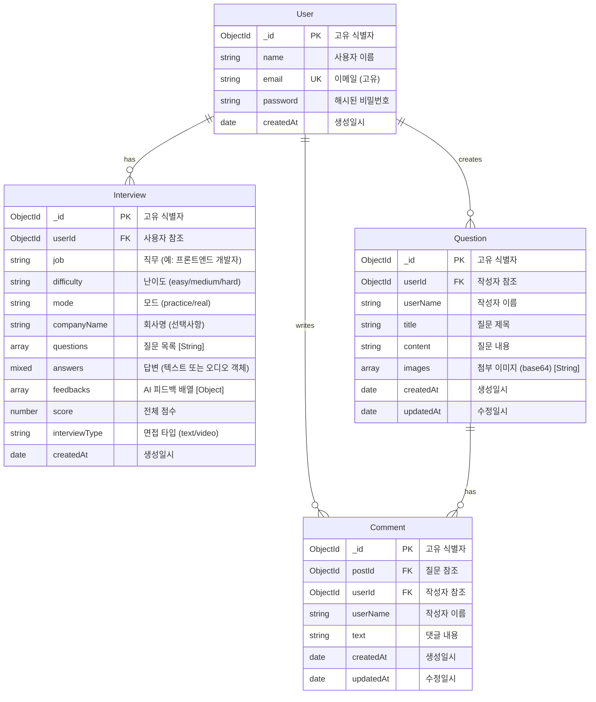

# AI 면접 시스템 ER 다이어그램

## 데이터베이스 스키마

## 엔티티 상세 설명

### User (사용자)
- **역할**: 시스템 사용자 정보 저장
- **주요 필드**:
  - `_id`: MongoDB ObjectId (Primary Key)
  - `email`: 고유 이메일 주소 (Unique Key)
  - `password`: bcrypt로 해시된 비밀번호
  - `name`: 사용자 이름
  - `createdAt`: 계정 생성일시

### Interview (면접 기록)
- **역할**: 사용자의 면접 기록 및 결과 저장
- **주요 필드**:
  - `_id`: MongoDB ObjectId (Primary Key)
  - `userId`: User 참조 (Foreign Key, 1:N 관계)
  - `job`: 직무 (예: "프론트엔드 개발자", "백엔드 개발자")
  - `difficulty`: 난이도 ("easy", "medium", "hard")
  - `mode`: 면접 모드 ("practice": 연습 모드, "real": 실전 모드)
  - `companyName`: 회사명 (선택사항, 기업별 면접용)
  - `questions`: 질문 목록 (문자열 배열)
  - `answers`: 답변 (Mixed 타입)
    - 텍스트 면접: 문자열 배열
    - 비디오 면접: 오디오 객체 배열 (base64Audio, mimeType, duration 등)
  - `feedbacks`: AI 피드백 배열 (각 질문별 피드백 객체)
  - `score`: 전체 점수 (평균 점수)
  - `interviewType`: 면접 타입 ("text": 텍스트 면접, "video": 비디오 면접)
  - `createdAt`: 면접 기록 생성일시

### Question (커뮤니티 질문)
- **역할**: 사용자가 작성한 커뮤니티 질문 게시글 저장
- **주요 필드**:
  - `_id`: MongoDB ObjectId (Primary Key)
  - `userId`: 작성자 참조 (Foreign Key, 1:N 관계)
  - `userName`: 작성자 이름 (데노말라이제이션)
  - `title`: 질문 제목
  - `content`: 질문 내용
  - `images`: 첨부 이미지 (base64 인코딩된 문자열 배열)
  - `createdAt`: 작성일시
  - `updatedAt`: 수정일시

### Comment (댓글)
- **역할**: 커뮤니티 질문에 대한 댓글 저장
- **주요 필드**:
  - `_id`: MongoDB ObjectId (Primary Key)
  - `postId`: Question 참조 (Foreign Key, 1:N 관계)
  - `userId`: 작성자 참조 (Foreign Key, 1:N 관계)
  - `userName`: 작성자 이름 (데노말라이제이션)
  - `text`: 댓글 내용
  - `createdAt`: 작성일시
  - `updatedAt`: 수정일시

## 관계 설명

### 1. User ↔ Interview (1:N)
- **관계**: 한 사용자는 여러 면접 기록을 가질 수 있음
- **제약조건**: 
  - Interview 삭제 시: CASCADE (사용자 삭제 시 관련 면접 기록도 삭제)
  - Interview 조회 시: userId로 필터링하여 사용자별 면접 기록 조회

### 2. User ↔ Question (1:N)
- **관계**: 한 사용자는 여러 질문을 작성할 수 있음
- **제약조건**:
  - Question 삭제 시: CASCADE (사용자 삭제 시 관련 질문도 삭제)
  - Question 수정/삭제: 작성자만 가능 (userId 검증)

### 3. User ↔ Comment (1:N)
- **관계**: 한 사용자는 여러 댓글을 작성할 수 있음
- **제약조건**:
  - Comment 삭제 시: 작성자만 삭제 가능 (userId 검증)

### 4. Question ↔ Comment (1:N)
- **관계**: 한 질문에는 여러 댓글이 달릴 수 있음
- **제약조건**:
  - Comment 조회 시: postId로 필터링하여 질문별 댓글 조회
  - Question 삭제 시: 관련 댓글도 함께 삭제 (CASCADE)

## 인덱스 전략

### User
- `email`: Unique Index (고유 제약조건)

### Interview
- `userId`: Index (사용자별 면접 기록 조회 최적화)
- `createdAt`: Index (최신순 정렬 최적화)

### Question
- `userId`: Index (작성자별 질문 조회 최적화)
- `createdAt`: Index (최신순 정렬 최적화)

### Comment
- `postId`: Index (질문별 댓글 조회 최적화)
- `userId`: Index (작성자별 댓글 조회 최적화)
- `createdAt`: Index (시간순 정렬 최적화)

## 데이터 흐름

### 면접 프로세스
1. **사용자 등록/로그인** → User 생성/조회
2. **면접 시작** → Interview 생성 (userId, job, difficulty, mode 등)
3. **질문-답변 진행** → Interview의 questions, answers 업데이트
4. **피드백 생성** → OpenAI API 호출 → Interview의 feedbacks 업데이트
5. **면접 완료** → Interview의 score 계산 및 저장

### 커뮤니티 프로세스
1. **질문 작성** → Question 생성 (userId, title, content 등)
2. **댓글 작성** → Comment 생성 (postId, userId, text)
3. **질문 수정/삭제** → Question 업데이트/삭제 (작성자만 가능)
4. **댓글 삭제** → Comment 삭제 (작성자만 가능)

## 보안 고려사항

1. **비밀번호**: bcrypt 해싱 (salt rounds: 10)
2. **인증**: JWT 토큰 기반 인증
3. **권한**: 
   - Interview: 본인 것만 조회/수정/삭제 가능
   - Question: 본인이 작성한 것만 수정/삭제 가능
   - Comment: 본인이 작성한 것만 삭제 가능
4. **데이터 검증**: 
   - 이메일 중복 체크
   - 필수 필드 검증
   - 데이터 타입 검증

## 확장 가능성

### 향후 추가 가능한 엔티티
- **Company**: 회사 정보 (회사명, 로고, 설명 등)
- **JobCategory**: 직무 카테고리 (계층 구조)
- **InterviewTemplate**: 면접 템플릿 (기업별, 직무별)
- **Statistics**: 통계 데이터 (사용자별, 전체 통계)

### 향후 추가 가능한 관계
- **User ↔ Company**: 사용자가 관심 있는 회사 (Many-to-Many)
- **Interview ↔ InterviewTemplate**: 면접이 사용한 템플릿 (Many-to-One)
- **User ↔ Statistics**: 사용자별 통계 (One-to-One)

